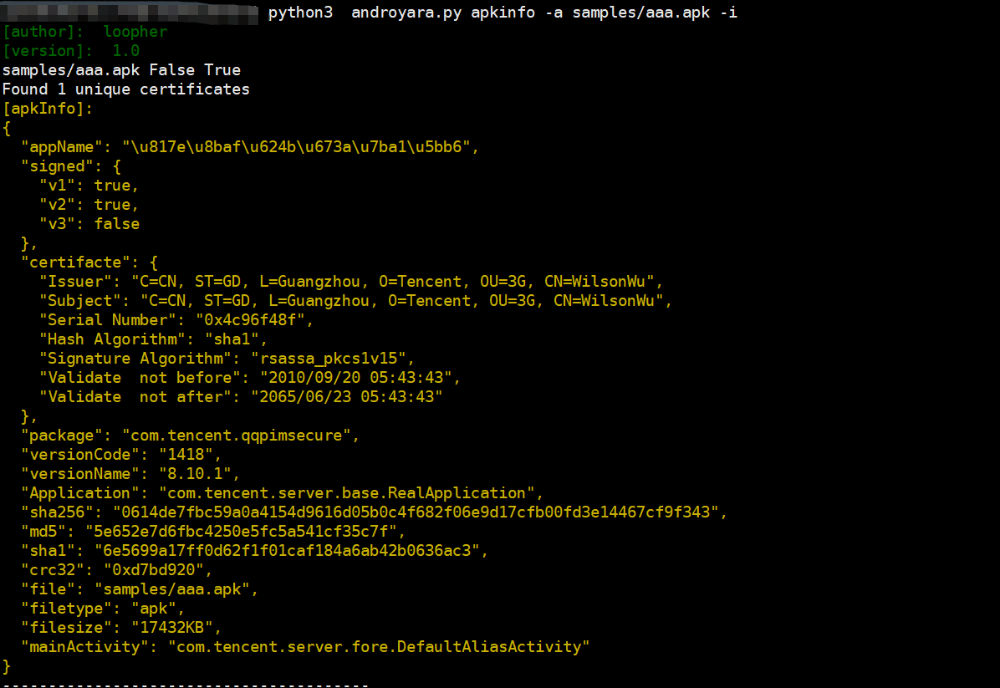
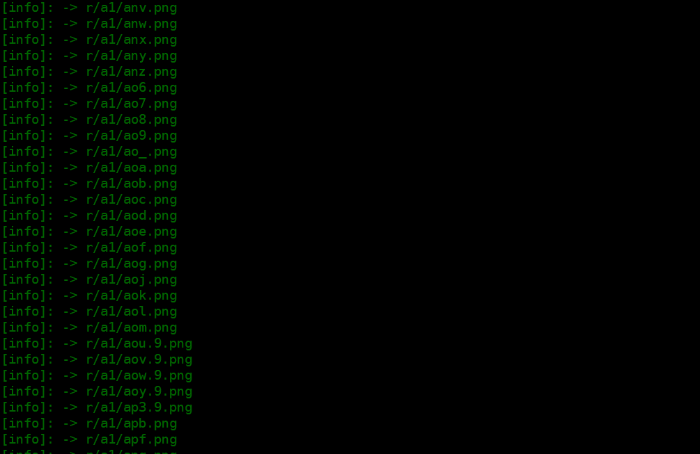
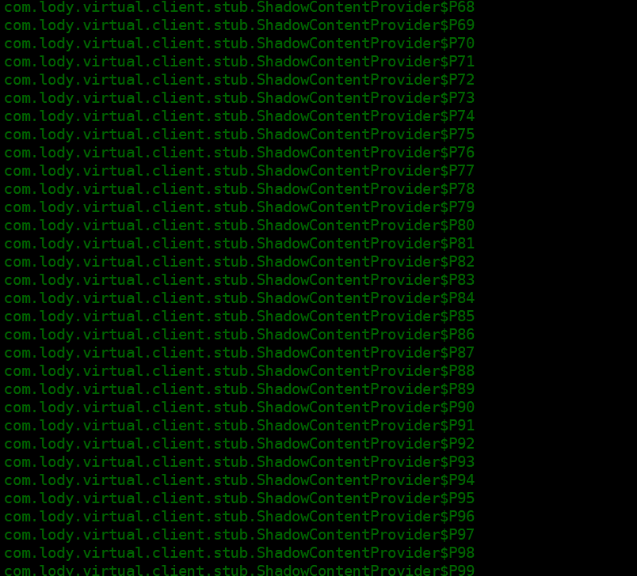
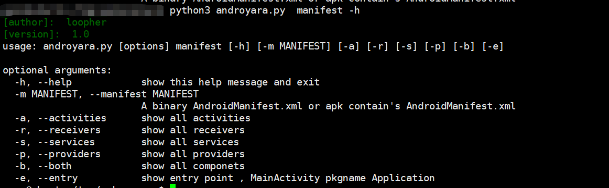
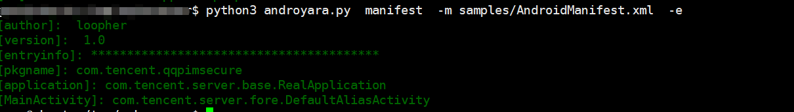

# Androyara

`Androyara` 是基于`python3.7+`开发的`android apk` 分析的工具，主要用于`android`的病毒分析和特征提取，也包括一些其他的信息提取。

主要功能

* 读取apk基本信息
* 读取AndroidManifest.xml 信息
* 搜索Apk/Dex内的字符串，方法，指令，类型
* 支持yara

```shell
python3 androyara.py -h
[author]:  loopher 
[version]:  1.0 

usage: androyara.py [options]

optional arguments:
  -h, --help            show this help message and exit

options:
  {query,search_dex,manifest,apkinfo,search_apk,yara_scan}
    query               query from VT
    search_dex          search dex string or method all instructions from dex
    manifest            Parsing Binary AndroidManifest.xml
    apkinfo             Apk base info
    search_apk          search string or method instructions from apk
    yara_scan           Using yara rule to scan

```

## 使用方法
### 读取apk基本信息
要想获取一个apk的基本信息包括
* `application`
* `MainActivity`
* `fingerprint: sha256`
* `signed version: V1 V2 V3`
* `certification`
* `pkgname`
* `appName`

使用如下命令
```shell
python3 androyara apkinfo -a samples/aaa.apk -i
```


还可以查看`apk内的文件`，使用如下命令
```shell
python3 androyara.py apkinfo -a samples/aaa.apk --zipinfo
```



### 读取AndroidManifest.xml 信息
有时候只需要获取`AndroidManifest.xml` 的信息而不需要读取`apk`的全部信息，使用`manifest` 选项可以获取`AndroidManifest.xml`的信息。


**支持AndroidManifest.xml和输入apk来读取**
主要输出内容 `包名和四大组件信息`，如下

```shell
python3 androyara.py  manifest -m samples/AndroidManifest.xml -b
```

可以只选择查看`activity` 或者其他的组件信息，**还可以查看所有支持exported 属性的组件** 
使用帮助命令
```shell
python3 androyara.py  manifest -h
```


如果想看入口信息，可以使用如下方法
```shell
python3 androyara.py  manifest -m samples/AndroidManifest.xml -e 
```


###  搜索Apk/Dex内的字符串，方法，指令，类

#### 获取apk内的字符串
#### 获取dex内的字符串
#### 获取类，方法信息
#### 获取指令信息

### 使用yara

## 最后
