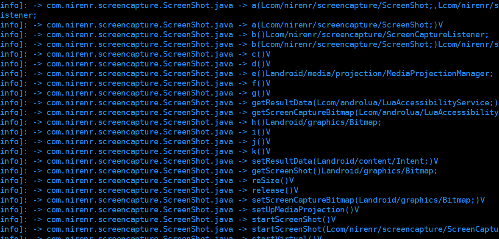

# Androyara

[](https://github.com/BiteFoo/androyara)
[](https://github.com/BiteFoo/androyara/blob/master/LICENSE-2.0)

`Androyara` 是基于`python3.7+`开发的`android apk` 分析的工具，主要用于`android`的病毒分析和特征提取，也包括一些其他的信息提取。

主要功能

* 读取apk基本信息
* 读取AndroidManifest.xml 信息
* 搜索Apk/Dex内的字符串，方法，指令，类型
* 支持yara
* Vt查询功能
* APK加固信息 `2021-06-17 add`

## install 
get  [download](https://github.com/BiteFoo/androyara/releases)
```shell
pip3 install androyara-xxx-py3-none-any.whl
```
comands 

```shell
python3 androyara  -h
usage: androyara.py [options]

optional arguments:
  -h, --help            show this help message and exit

options:
  {query,search_dex,manifest,apkinfo,search_apk,yara_scan}
    query               query from VT
    search_dex          search dex string or method all instructions from dex
    manifest            Parsing Binary AndroidManifest.xml
    apkinfo             Apk base info
    search_apk          search string or method instructions from apk
    yara_scan           Using yara rule to scan

```

## 使用方法

### 读取apk基本信息
要想获取一个apk的基本信息包括
* `application`
* `MainActivity`
* `fingerprint: sha256`
* `signed version: V1 V2 V3`
* `certification`
* `pkgname`
* `appName`

使用如下命令
```shell
python3 androyara apkinfo -a samples/aaa.apk -i
```
> 增加显示加固信息


还可以查看`apk内的文件`，使用如下命令
```shell
python3 -m androyara apkinfo -a samples/aaa.apk --zipinfo
```


### 读取AndroidManifest.xml 信息
有时候只需要获取`AndroidManifest.xml` 的信息而不需要读取`apk`的全部信息，使用`manifest` 选项可以获取`AndroidManifest.xml`的信息。


**支持AndroidManifest.xml和输入apk来读取**
主要输出内容 `包名和四大组件信息`，如下

```shell
python3 androyara  manifest -m samples/AndroidManifest.xml -b
```

可以只选择查看`activity` 或者其他的组件信息，**还可以查看所有支持exported 属性的组件** 
使用帮助命令
```shell
python3 androyara   manifest -h
```


如果想看入口信息，可以使用如下方法
```shell
python3 androyara   manifest -m samples/AndroidManifest.xml -e 
```


###  搜索Apk/Dex内的字符串，方法，指令，类
可以通过命令查看`apk` 或者`dex`内的方法和指令，程序内过滤了些`google`的类。

#### 获取apk内的字符串
> 使用正则表达式来做搜索，也可以指定某个字符串搜索


基本使用方式可以查看帮助命令


可以通过一个正则表达式或者字符串类搜索，例如这里的`://` 获取包含了如下的字符串
```shell
http://
https://
content://
protocol://
```
如下

或者可以全部输出字符串


或者查找是否存在特定的字符串


#### 获取dex内的字符串
使用方式同`apk`类似，只需要指定`.dex`即可。

#### 获取类，方法信息
例如要想获取所有的方法和类，可以填入一个`-m '' `的空字符串


#### 获取指令信息
例如这里要`com.nirenr.screencapture.ScreenShot.java -> startVirtual()V`的方法指令，使用如下

有时候同名的方法很多，但是每个方法的签名和类不一样，因此可以通过`-c classname -m method(signature)` 的方式获取，如下是获取 

获取方式

使用上述方法就能获取到对应的指令信息。

### 使用yara

**逆向分析apk**
在逆向分析一个`apk`之后为了能查杀出对应的家族会需要写规则来查杀，使用`androyara`可以对感兴趣的字符串和方法指令进行获取并快速写出`yara` 规则。

首先通过`字符串`的方式查询是否存在特殊的字符串，例如这里查询`://`如下


从输出的内容中可以看到比较有价值的请求地址，可以作为一个`yara` 的规则。

接着为了能更准确的查杀对应的病毒，这里逆向分析一下apk后定位一个关键函数，如下

这里将这个方法作为主要的特征`shellcode` ，使用如下方式获取指令信息
先获取方法签名信息看是否一致

接着获取指令信息

最后在`shellcode`中看到输出的结果


**编写yara规则**

扫描结果


为了能更体现准确性，在测试目录放了`200+`的apk，如下


再次扫描后如下

可以看到准确率还是很好。

还可以支持`.dex`的方式检测，目的是有些`apk`是加固的，可以通过脱壳后进行查杀，具体查看帮助命令
```shell
 python androyara  yara_scan -h
```

### VT查询
**请将USR_CONFIG_INI设置为指定到user.conf的环境变量**
```shell
# windows 
set USR_CONFIG_INI=D:\\user.config
# Unix 
export USR_CONFIG_INI=$HOME/user.config
```

需要在user.conf 内填写api key,参考user/user.conf文件配置填写

可以通过命令行查询`vt`结果，如下

```shell
python3 androyara  query -s ee70eda8a7f6b209c6bb4780bf2a8a96730c19a78300eb5ec3c25a48e557cb2e
```


## build
```shell
pip3 install -r requirements.txt
python3 setup.py bdist_wheel
pip3 install dist/androyara-version-py3-none-any.whl
```


## 感谢
[androguard](https://github.com/androguard/androguard)

[malwoverview](https://github.com/alexandreborges/malwoverview/tree/master/malwoverview)

[yara documents](https://buildmedia.readthedocs.org/media/pdf/yara/latest/yara.pdf)

[yara python](https://github.com/VirusTotal/yara-python)
